# Chessparnado

**Chesspernado** is an original game made by Danilo Novakovic inspired by Chess, Tetris and Plants vs Zombies.
The game is Player vs AI, played on a 12x8 board. Players goal is to protect the first row as long as possible
from the attacking enemy pieces. Player starts with 3 knights and 2 bishops, and is able to upgrade and buy
more from the shop as the game progresses.

> More on rules of the chessperando, figure movement, and notation in the program can be found in Documentation.pdf
aswell as, in any time, inside of programm by typing command `/help` or by selection option 2. from the main menu.

---

## Table of Contents

- [Getting Started](#getting-started)
  - [Prerequisites](#prerequisites)
  - [Setup](#setup)
- [Game rules](#game-rules)
  - [Goal of the game](#goal-of-the-game)
  - [Phases](#phases)
  - [Turns](#turns)
  - [Supported Commands](#supported-commands)
  - [Pieces and movement](#pieces-and-movement)
- [Personal Logs](#personal-logs)
- [Support](#support)
- [License](#license)

---

## Getting started

### Prerequisites

This game uses **C** programming language standard libraries (*ANSII C Standard*)
(No external library is needed, you only need `gcc` compiler and UNIX Terminal (*ex. Linux or WSL for Windows*))

### Setup

Use these steps to compile and start console application.

#### Linux

- Open terminal
- Navigate to the project repository
- Enter `make`.
- After you compile it you can run it by typing `./chesspernado`

#### Windows

- Install [WSL (Windows Subsystem for Linux)](https://docs.microsoft.com/en-us/windows/wsl/install-win10)
- Navigate to the project repository in WSL terminal
- Enter `make` (*Compiles the program*)
- Start program by running `./chesspernado`

> In case you run into problems related to missing packages try using `sudo apt-get install build-essential` command (it should install `gcc` and `make` alongside [other usefull tools](https://packages.ubuntu.com/xenial/build-essential))

---

## Game rules

### Goal of the game

The goal of the game is to stop enemy pawns & bishops from reaching to 1st row of the board.

- If board is *FULL* on AI's turn, then the game will end.
- If player lost *ALL OF HIS PIECES* then the game will end.

At the end of the game player will be prompted to enter the name, after which the result will be printed out in the *scoreboard.txt*

> Score won't be recorded if the program has been closed with /exit command

### Phases

#### Initial setup

At the beginning of the game player decides places 3 knights and 2 bishops on any column from 1st to 5th row of the board. During this phase player can use :

- `/end, /exit` - exit the game
- `/re` - resets the initialization setup
- `/random` - generates bishops and knights on random positions.

Upon completion player will be prompted to confirm the setup.

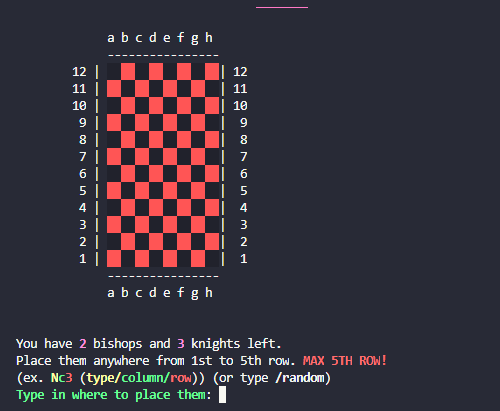

#### Waves

After [initial setup](#initial-setup), the game begins, and first randomly generated wave starts. Each wave gets harder and harder as the game goes on.

### Turns

`PLAYER` - is able to move 1 piece during his turn (with exeption of shop).

`ENEMY_AI` - During 1 turn EVERY piece with legal moves will be moved. If NO PIECE has ANY LEGAL MOVE then *N* new pawns will be randomly generated anywhere from 7 to 12th row.

### Supported commands

`/back` - goes back to the main menu.

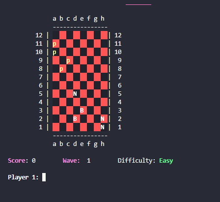

`/hint` - prints available places where a certain piece can move. Or prints out info for Happy King, Suicide Rook or empty piece.

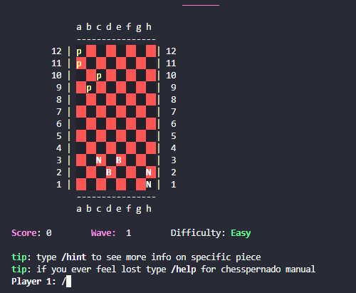

`/random` - only at init_setup (beginning stage). Generates 3 knights and 2 bishops on random positions.

`/exit`, `/end` - exits the program.

`/undo` - undoes previous move. Can be used from start to finish of the **CURRENT** wave. **Once the wave completes undo history is deleted!**

`/help` - prints Chesspernado Manual whenever you want during the game.

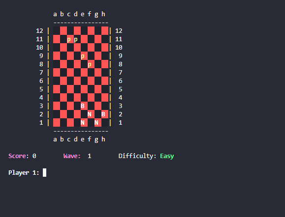

`/skip` - skips 1 move during wave.

`/revive` - you can sacrifice *60* points to revive dead piece (you can set him anywhere from 1st to 5th row)

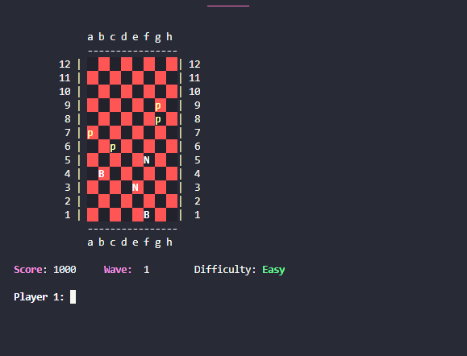

`/buy` - summons *STORE* window, from which you can buy certain pieces and features for *X* points.

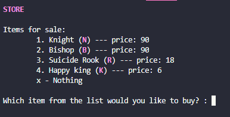

### Pieces and Movement

Notation of the moves is as follows:
**Piece**/*column*/*row*/column/row
(**what piece do you want to move**, *from where*, to where)

Examples: **B***f4*d6, **N***b8*c6

#### SUICIDE ROOK (R)

Is a special piece that lasts for **ONE MOVE ONLY**. He first waits for player /other pieces to make a move, and
then sprints forward [i+k][j] until he hits ANYTHING (either end of the board, enemy or the player). Once he collides with an object he will then explode, killing both himself and that object (either player or enemy). User can buy this piece in the shop as many times as he likes as long as he has points for it, and he can place as many as the suicide rooks he likes. If there are multiply suicide rooks on the boardthe priority will have those in front.

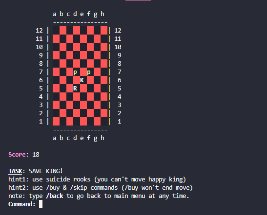

#### HAPPY KING (K)

Is a special piece that lasts until destroyed.Happy King is so happy that he won't hurth a fly, meaning that **he cannot kill other enemy pieces**. He shares his love of life with player, and **generates 1 point each turn**.
Happy king can't be moved. User can buy this piece from the shop, and it is generated on random positions anywhere from 1st row to 5th, on any column.

#### BISHOP (B)

Can move any number of squares diagonally, but cannot leap over other pieces.

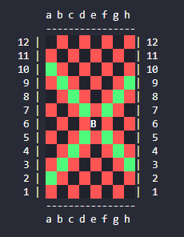

#### AI_BISHOP (b)

Has rules of regular bishop but will only move in
following manner. BISHOP AI always "wakes up on the left foot"
meaning that he will prioritize moving as far to the bottom-left as he
can above all. Only if he is unable to move to the left anymore
will he swap directions meaning he will move as far to the bottomright
as he can. AI_BISHOP will only eat enemy piece if it is caught
in this LEFT-RIGHT pattern.

> AI_BISHOP is worth 12 points

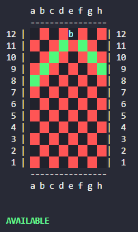

#### KNIGHT (N)

The knight moves to any of the closest squares that are not on the same rank, file, or diagonal, thus the move forms an "L"-shape: two squares vertically and one square horizontally, or two squares horizontally and one square vertically.
The knight is the only piece that can leap over other pieces.

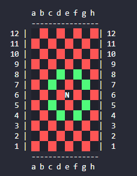

#### AI_PAWN (p)

The pawn can move forward to the unoccupied square immediately in front of it on the same file, or on its first move it can advance two squares along the same file, provided both squares are unoccupied; or the pawn can capture an opponent's piece on a square diagonally in front of it on an adjacent file, by moving to that square. The *AI_PAWN* will prioritize eating enemy piece over going forward.

> AI_PAWN is worth 6 points

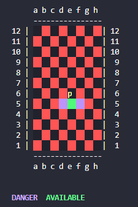

---

## Personal logs

### 9/May/2019

This project is an example of how NOT to write code. It is full of code smells and poorly named variables, with methods that do too many things.

Additionally it is not covered by tests making even refactoring pretty hard.

However, it holds significant historical value to myself since it taught me alot.

At the time of writing this project i was just starting out and this was biggest challange i posed to myself at that time. A new challange today would be to refactor this into more readable code without breaking its functionality.

---

## Support

Reach out to me at one of the following places!

- Website at <a href="https://danilonovakovic.github.io/index.html" target="_blank">`danilonovakovic.github.io`</a>
- Linkedin at <a href="https://www.linkedin.com/in/danilo-novakovi%C4%87-821934167/" target="_blank">`DaniloNovakovic`</a>

> Special thanks to alpha-testers: [Vladimir Ivkovic](https://github.com/vladimirivkovic), Vladimir Virijevic, [Vuk Isic](https://github.com/vukisic), Slavko Lukic and Aleksandar Ristic

---

## License

- **[GPLv3 License](https://www.gnu.org/licenses/gpl-3.0)**
- Copyright 2017 © [DaniloNovakovic](https://github.com/DaniloNovakovic)
